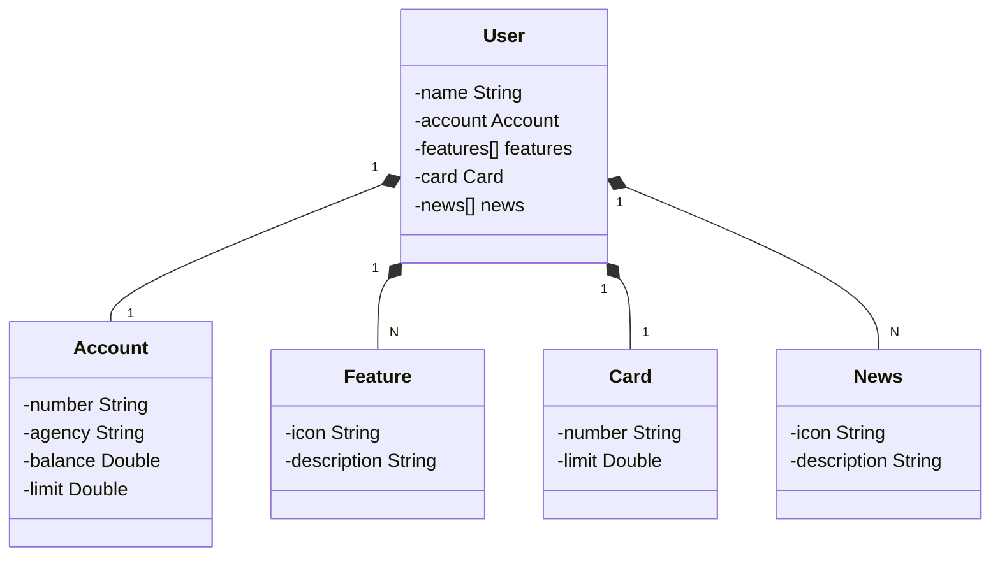

"# dio-java-avancado-desafios" 

Repositório para armazenar todo o conteúdo do curso de Java Avançado.

[Observações] - Projeto para fins de aprendizado.
Deu algum B.O (Tenho que descobrir oque) -> Provisionando o PostgreSQL (Railway) e Criando o Perfil de PRD.
Deploy da API na Nuvem (Railway)(Não tive tempo de chegar nesta parte).

##Diagrama de Classes

